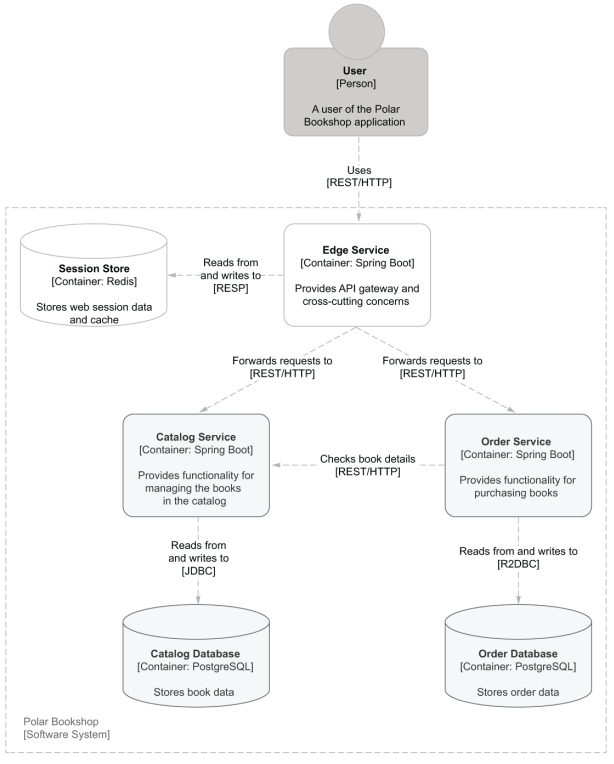

# Polar Bookshop


---
## Set Up Instructions
### 1. Install required software
* Install <a target="_blank" href="https://www.docker.com/">Docker</a>
* Install <a target="_blank" href="https://docs.docker.com/compose/install/">Docker Compose</a>
* Install <a target="_blank" href="https://minikube.sigs.k8s.io/docs/start/">Minikube</a>
* Install <a target="_blank" href="https://kubernetes.io/docs/tasks/tools/">Kubectl</a>
* Install <a target="_blank" href="https://docs.tilt.dev/index.html">Tilt</a>

### 2. Clone this Repository
Clone this repository and run the following commands in the root directory
of the repository

### 3. Run with Docker Compose
```bash
docker compose up
```

### 4. Develop with Tilt in Minikube

```bash
chmod +x ./create-k8s-cluster
./create-k8s-cluster
tilt up
```
